# Autómatas Finitos

En los problemas 94-123, debe hallar un Autómata Finito Determinista (AFD) que distinga las palabras del lenguaje que se describe con el alfabeto que se indica. Debe representar la respuesta usando el diagrama de transiciones y la tabla de transiciones. Los alfabetos utilizados son:
$\Sigma_1 = \{0, 1, 2\}$, $\Sigma_2 = \{a, b, c, 0, 1\}$, $\Sigma_3 = \{a, b\}$

**97. \*** Las palabras de $\Sigma_1$ cuya longitud es un múltiplo de 3.

Diagrama:
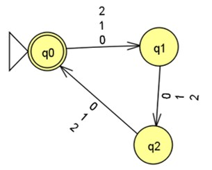

Tabla de estados:
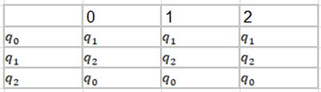

El autómata utiliza sus tres estados ($q_0, q_1, q_2$) como un contador. El estado inicial $q_0$ también es el de aceptación, representando longitud 0, 3, 6, etc. Cualquier símbolo leído avanza la cuenta cíclicamente.

---

**99. \*** Las palabras de $\Sigma_1$ que terminan con la cadena 001001.

Diagrama:
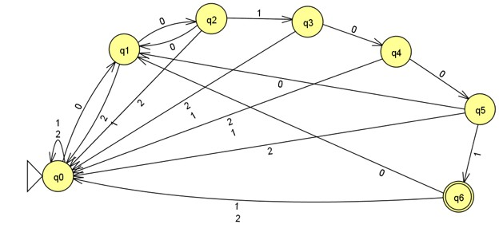

Tabla de estados:
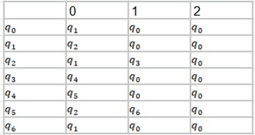

El diagrama muestra una tira secuencial ($q_0 \to q_1 \to \dots \to q_6$) que avanza únicamente si se lee la secuencia exacta "001001". El único estado de aceptación es $q_6$. Si se ingresa un símbolo incorrecto, el autómata retrocede al estado $q_0$ o al estado que represente el prefijo válido más largo recuperado.

---

**102. \*** Las palabras de $\Sigma_3$ que contienen la cadena abbbab.

Diagrama:
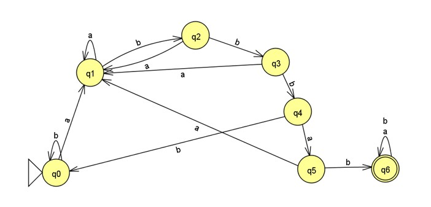

Tabla de estados:
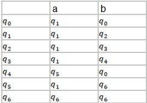

A diferencia del ejercicio 99, este autómata busca una subcadena. El camino lineal de $q_0$ a $q_6$ confirma la lectura de "abbbab". Una vez que se llega a $q_6$, este actúa como un sumidero de aceptación, ciclándose en sí mismo sin importar qué símbolos sigan.

---

**103. \*** Las palabras de $\Sigma_3$ que contienen la cadena aabbba.

Diagrama:
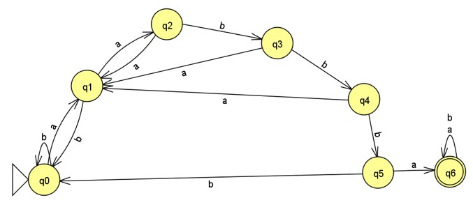

Tabla de estados:
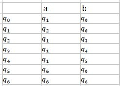

Similar al diseño anterior, emplea un camino secuencial que avanza al leer "aabbba". Alcanzar el estado $q_6$ asegura que la cadena ha sido contenida, por lo que atrapa cualquier entrada posterior manteniéndose en estado de aceptación.

---

**106. \*** Las palabras de $\Sigma_1$ que incluyen la subcadena 1101001.

Diagrama:
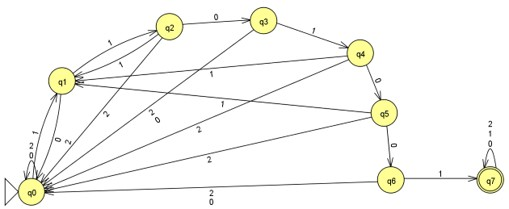

Tabla de estados:
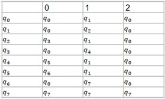

Su estructura es una línea secuencial de 7 transiciones clave. Su estado final $q_7$ es un pozo de aceptación. Si durante el trayecto hacia $q_7$ aparece un '2' (símbolo no presente en el patrón), el autómata se reinicia completamente regresando a $q_0$.

---

**107. \*** Las palabras de $\Sigma_1$ que incluyen al menos una vez la subcadena 0101 y al menos una vez la subcadena 021.

Diagrama:
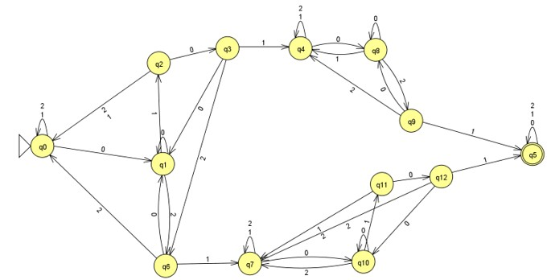

Tabla de estados:
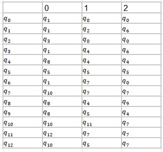

El diagrama expone una arquitectura de dos grandes bloques para permitir la permutación. Una vía detecta la aparición de "0101" y posteriormente transita a un sub-autómata que busca "021". La vía inferior opera de forma inversa: detecta primero "021" y luego "0101". Solo cuando se recorre una de las dos vías se llega a el estado de aceptación final.

---

**109. \*** Las palabras de $\Sigma_2$ que incluyen al menos una vez la subcadena abbcb y al menos una vez la subcadena cbaabb, asumiendo que sí se pueden traslapar.

Diagrama:
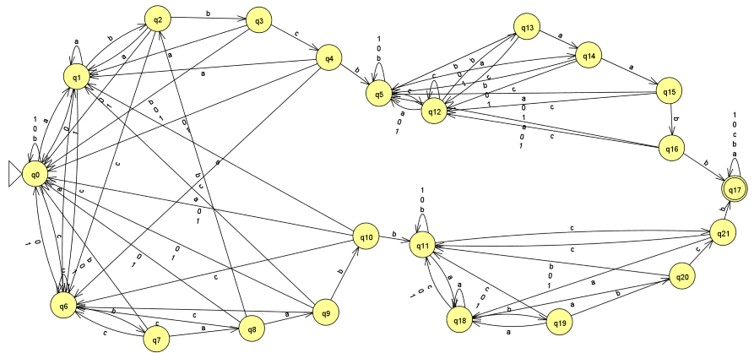

Es un autómata que permite el traslape. Si la secuencia leída hace coincidir el final de "abbcb" con el inicio de "cbaabb" (compartiendo la 'c' o las 'b'), el autómata aprovecha esa letra gracias a las transiciones cruzadas entre los sub-bloques, en lugar de reiniciar el conteo.

---

**111. \*** Las palabras de $\Sigma_1$ que contienen exactamente tres veces la subcadena 01002.

Diagrama:
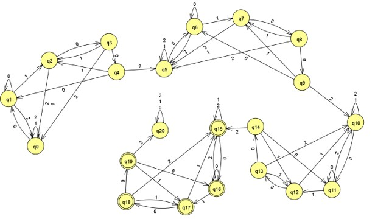

Tabla de estados:
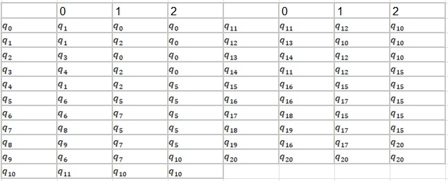

El diseño replica el reconocedor de la subcadena base "01002" tres veces en serie. Al completarse por primera vez, pasa al bloque 2, luego al bloque 3, donde entra en varios estados de aceptación donde si el patrón es detectado una cuarta vez, pasa a un estado de rechazo constante.

---

**112. \*** Las palabras de $\Sigma_1$ que contienen dos veces la subcadena 010, asumiendo que no se pueden traslapar; es decir, que 01010 no está en el lenguaje, mientras que 010010 sí pertenece.

Diagrama:
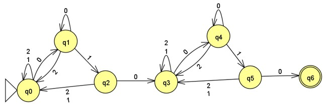

Tabla de estados:
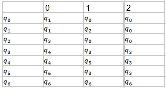

Tras detectar "010" por primera vez, el autómata transita a un estado intermedio que actúa como un nuevo estado inicial. Como no permite traslape, si llega un '0' justo después de terminar, asume que es el primer '0' del segundo bloque. Un caso como "01010" fallará, requiriendo "010010" para avanzar correctamente al segundo bloque de detección.

---

**113. \*** Las palabras de $\Sigma_1$ que contienen dos veces la subcadena 010, asumiendo que sí se pueden traslapar.

Diagrama:
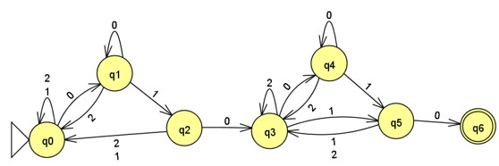

Tabla de estados:
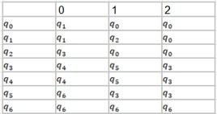

A diferencia del anterior, este diagrama permite compartir caracteres. Al aceptar el primer "010", el autómata transita a un estado donde ya se da por hecho la lectura del primer '0' del segundo patrón. Por tanto, si recibe "10" inmediatamente después del primer patrón (formando "01010"), alcanza el estado de aceptación.

---

**118. \*** $L = \{w \in \Sigma_3 : w = axabya, x, y \in \Sigma_3^*\}$

Diagrama:
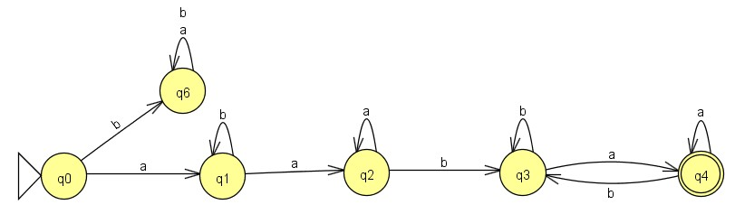

Tabla de estados:
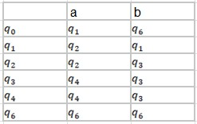

El estado inicial $q_0$ fuerza a que la cadena comience con 'a' para avanzar a $q_1$. Si inicia con 'b', se desvía de forma permanente al estado sumidero de rechazo $q_6$. Los estados $q_1$ y $q_2$ procesan la subcadena intermedia $x$ mientras localizan la secuencia obligatoria "ab". Los estados $q_3$ y $q_4$ procesan la subcadena $y$ garantizando que el último carácter de la palabra sea siempre 'a'. Al leer una 'a' desde $q_3$, avanza al estado de aceptación $q_4$. Si estando en $q_4$ llega una 'b', la palabra pierde su terminación válida, por lo que el autómata retrocede a $q_3$ a la espera de recuperar el estado de aceptación con una nueva 'a'.

---

**120. \*** Las palabras de $\Sigma_1$ tales que el primer carácter y el último son distintos.

Diagrama:
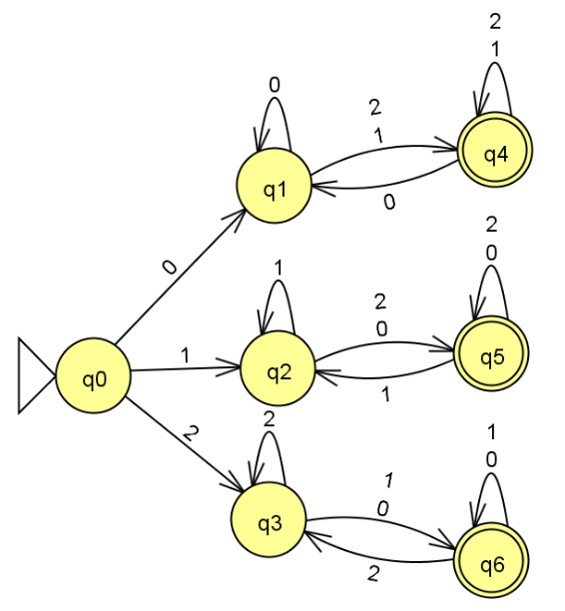

Tabla de estados:
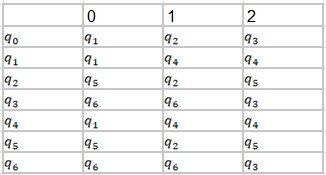

Al inicio ($q_0$), el autómata se divide obligatoriamente en tres pistas exclusivas, "recordando" si inició con 0 ($q_1$), con 1 ($q_2$) o con 2 ($q_3$). Cada pista aprueba si el símbolo más recientemente leído es diferente al símbolo que memorizó en el paso 1.

---

**121. \*** Las palabras de $\Sigma_1$ con longitud $3n$ para algún $n \in \mathbb{N}$, tales que, si se dividen en $n$ bloques de longitud 3, cada uno de éstos tiene al menos un 0. Por ejemplo, 000 011 110 101 es una palabra válida, mientras que 001 101 111 010 no lo es, pues el tercer bloque no tiene ningún 0.

Diagrama:
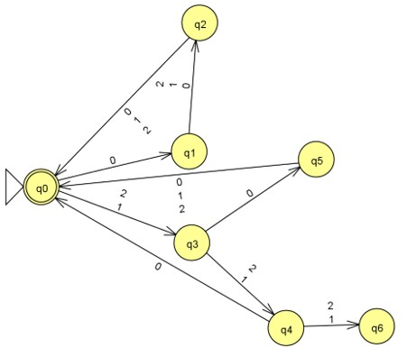

Tabla de estados:
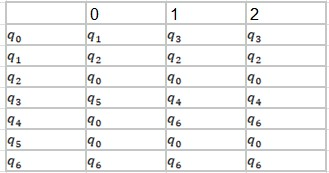

El diagrama procesa la entrada en ciclos estables de 3 saltos. La longitud debe ser múltiplo de 3, por ende, los estados de aceptación solo están al final de un ciclo completo. Si en los 3 saltos del ciclo se leen exclusivamente '1' o '2', el autómata se desvía irremediablemente hacia un estado sumidero de rechazo.

---

**122. \*** Las palabras de $\Sigma_1$ tales que cualquier cadena de tres símbolos consecutivos debe tener un 0. Nota que la cadena 001110 sí está en el lenguaje del problema anterior, pero no en este, mientras que 00101 está en el lenguaje de este problema y no en el del anterior.

Diagrama:
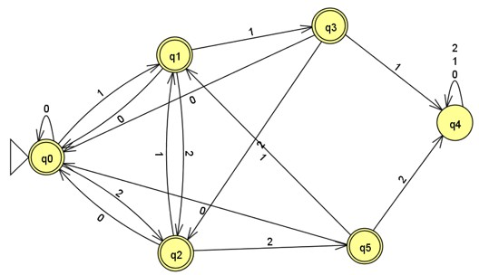

Tabla de estados:
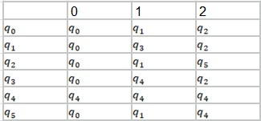

El autómata sirve como un contador de caracteres distintos de cero ('1' o '2'). El estado $q_0$ representa cero caracteres consecutivos sin '0'; $q_1$ representa uno; y $q_2$ representa dos. Si lee un tercer símbolo consecutivo distinto de '0', cae al sumidero de error $q_4$ (o $q_3$ dependiendo de tu numeración de sumidero). Cualquier '0' leído restablece el contador a $q_0$.

---

**123. \*** Las palabras de $\Sigma_3$ de la forma $wxw$ donde $w \in \Sigma_3^2$ y $x \in \Sigma_3^*$.

Diagrama:
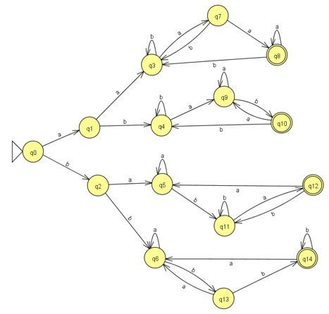

Tabla de estados:
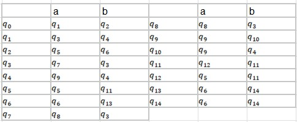

Aquí la notación indica que el prefijo $w$ tiene exactamente longitud 2 (al ser de $\Sigma_3^2$). El autómata ramifica desde el estado inicial en las 4 combinaciones posibles ("aa", "ab", "ba", "bb"). Una vez que el prefijo es memorizado en la rama correcta, el autómata procesa la subcadena intermedia $x$ y solo acepta si los últimos dos caracteres coinciden en el mismo orden con el $w$ que memorizó.

---

**124. \*** En el siguiente diagrama, se muestra un mecanismo con palancas. Se suelta una cadena de canicas ordenadas en las entradas 0 y 1, formando una palabra del alfabeto $\Sigma = \{0, 1\}$. De esta forma, la palabra 0010 significa que dos canicas caen por el conducto 0, luego se suelta una en 1, terminando con una cuarta en 0. En el juego se encuentran tres palancas. Si se encuentra en la posición izquierda, la canica se va al lado izquierdo, por el contrario, si la posición es derecha, se va al lado derecho. Cada vez que una canica pasa por una palanca, esta cambia de posición. Una palabra será aceptada si la última sale por A y será rechazada si la última canica sale por R.

Diagrama del mecanismo:
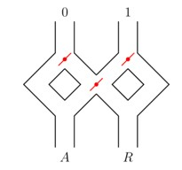

¿De cuantas formas pueden estar colocadas las tres palancas?

Dado que hay 3 palancas y cada una tiene 2 posiciones, el número total de configuraciones físicas es $2^3=8$ formas posibles.

Realice un dibujo de cada uno de los estados en los que pueden estar colocadas e identifique cual es el resultado de soltar una canica en 0 o en 1 en cada uno de los estados, así como la posición en la que quedaran las palancas después de cada caso.

Dibujo de estados:
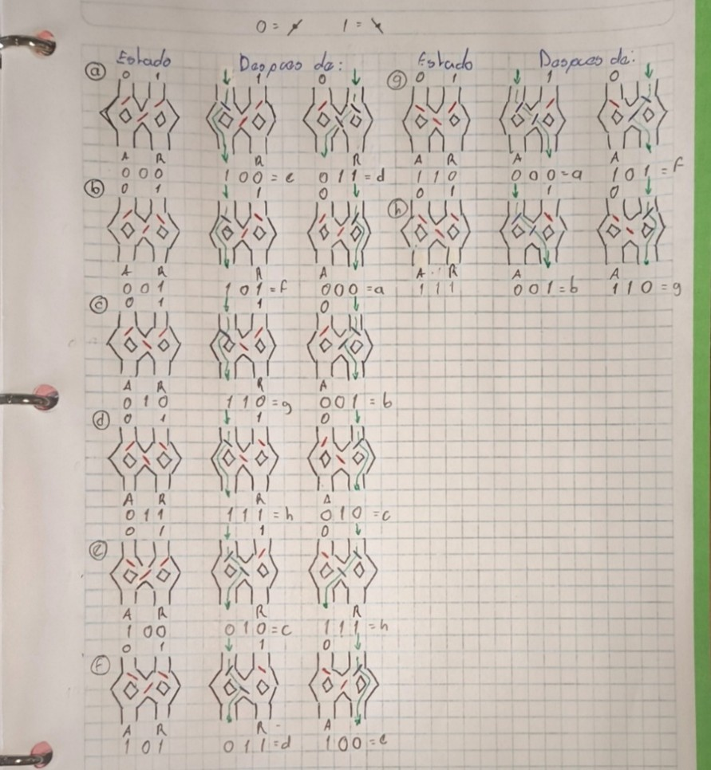

Encuentre la tabla de transiciones de un autómata finito determinista que describa si una palabra es aceptada o rechazada.

Se representa cada estado como una letra (a, b, c…) de acuerdo con los dibujos realizados en el inciso anterior, teniendo esta clasificación se pueden ver similitudes entre el cambio de estados y como el resultado de aceptación o rechazo depende de la transición entre estados de la última canica. Generando la siguiente tabla:

Tabla de estados:
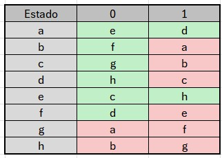

Donde la cadena seria aceptada si la ultima canica transita del estado en gris al estado en verde, por ejemplo, si la última canica entra por “1” estando en el estado “a” seria aceptado, en cambio si la ultima canica entra por “1” estando en el estado “g” seria rechazada. 

---

**128. \*** Sea L el lenguaje del autómata dado por el siguiente diagrama: 

Diagrama original:
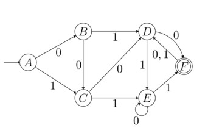

Encuentre un autómata finito determinista que identifique el lenguaje $L_2$ cuyas palabras son las palabras de L quitándoles el último símbolo. Es decir, si $001001 \in L$, entonces $00100 \in L_2$.

Diagrama del nuevo autómata:
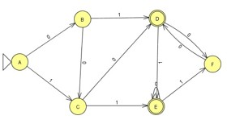

El lenguaje de $L_2$ solo será aceptada si al terminar de procesarla, el autómata se detiene justo en un estado donde hay exactamente una transición de distancia para llegar al estado de aceptación del autómata del lenguaje $L_1$. Esto quiere decir que para $L_2$ el estado de aceptación debe de estar a un paso de llegar F, siendo estos el estado D y E.

---

**131. \*** Dibuje el AFD dado por los siguientes elementos: 
$M = (\{q_1, q_2\}, \{0, 1\}, \delta, q_1, \{q_2\})$
La función de transición $\delta$ está definida como sigue: 
$\delta(q_1, 0) = q_1$ y $\delta(q_2, 0) = q_1$ 
$\delta(q_1, 1) = q_2$ y $\delta(q_2, 1) = q_2$
Determine un lenguaje $L(M)$ que el AFD reconoce.

Diagrama:
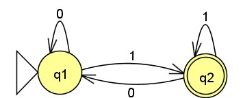

La función $\delta$ indica que leer un '0' siempre envía el autómata a $q_1$ (rechazo), y leer un '1' siempre lo envía a $q_2$ (aceptación). 
$L(M) =$ Todas las cadenas de $\{0,1\}^*$ que inician y terminan con el símbolo 1.

---

**133. \*** Obtener la tabla de estados y el diagrama de transiciones (esquema AFD) del autómata finito $M = (Q, \Sigma, \delta, q_0, F)$, donde: 
$Q = \{q_0, q_1, q_2, q_3\}$
$\Sigma = \{a, b\}$
$q_0$ es el estado inicial y también el estado final ($F = \{q_0\}$)
Las transiciones están definidas de la siguiente manera:
$\delta(q_0, a) = q_2$ 	$\delta(q_3, a) = q_1$ 	$\delta(q_2, b) = q_3$
$\delta(q_1, a) = q_3$ 	$\delta(q_0, b) = q_1$ 	$\delta(q_3, b) = q_2$
$\delta(q_2, a) = q_0$ 	$\delta(q_1, b) = q_0$

Diagrama:
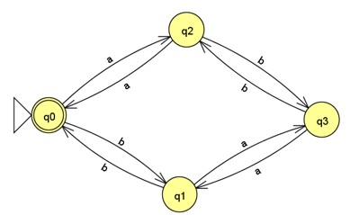

Tabla de estados:
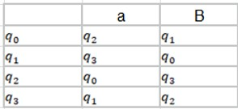

---

**135. \*** Dado $\Sigma = \{a, b\}$, construir un AFD que reconozca el lenguaje:
$L = \{b^m a b^n : m, n > 0\}$

Diagrama:
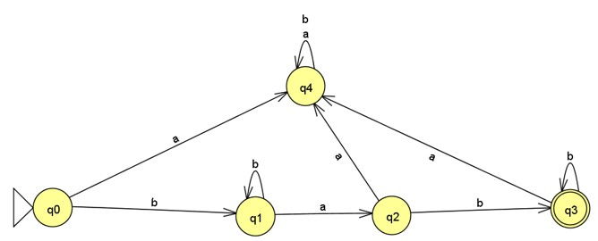

La cadena requiere: Al menos una 'b' inicial. Exactamente una 'a'. Al menos una 'b' final. Si aparece una segunda 'a' u otro orden, se rechaza.

---

**137. \*** Construir un AFD que reconozca el conjunto de todas las cadenas sobre $\Sigma = \{a, b\}$ que comiencen con el prefijo ’ab’.

Diagrama:
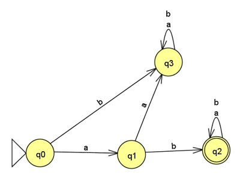

Se verifican estrictamente los dos primeros caracteres. Al confirmar 'a' y luego 'b', se pasa a un estado de aceptación absoluto.

---

**139. \*** Construya un autómata finito (FA) que acepte todas las cadenas en $\{0, 1\}^*$ que tengan un número par de ceros.

Diagrama:
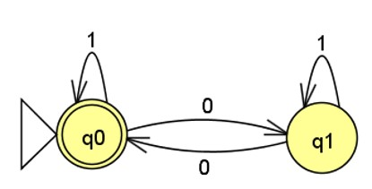

Solo hay dos estados respecto a la paridad: par e impar. El símbolo '1' no altera el estado. El estado 0 es el inicial (0 ceros leídos es par).

---

**141. \*** Determine un autómata finito (FA), M, que acepte el lenguaje L, donde:
$L = \{w \in \{0, 1\}^* : \text{cada 0 en w tiene un 1 inmediatamente a su derecha}\}$

Diagrama:
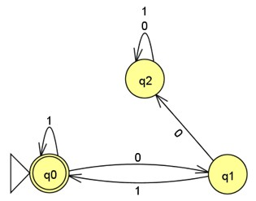

Si se lee un '0', el siguiente símbolo debe ser obligatoriamente un '1'. Si se lee otro '0' consecutivo, o si la cadena termina en '0', es inválida.

---

**143. \*** Determine los lenguajes producidos por los autómatas finitos (FA) mostrados en las Figuras (a) y (b).

Diagrama:
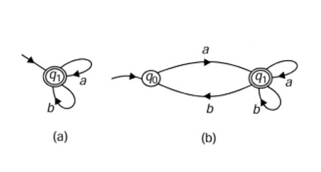

**Figura (a)**
El diagrama muestra un único estado $q_1$ que funciona simultáneamente como estado inicial y estado de aceptación. Este estado posee transiciones hacia sí mismo para los símbolos 'a' y 'b'.
Como el estado inicial es de aceptación, el autómata acepta la cadena vacía. Al tener bucles para todos los símbolos del alfabeto sin salir de este estado de aceptación, cualquier combinación de caracteres será válida. $L_A = \Sigma^*$ 

**Figura (b)**
El autómata comienza en el estado $q_0$. Para avanzar al estado de aceptación $q_1$, es obligatorio leer el símbolo 'a'. Si el primer símbolo leído es 'b', el autómata no tiene una transición definida desde $q_0$ y la cadena es rechazada inmediatamente. Una vez que se alcanza $q_1$, existen bucles para los símbolos 'a' y 'b' que mantienen la ejecución en el estado de aceptación. 
Aunque existe una transición de regreso de $q_1$ a $q_0$ al leer una 'b' (lo que lo clasifica como un Autómata Finito No Determinista debido a las múltiples opciones para 'b' en $q_1$), el bucle en $q_1$ garantiza que cualquier cadena que logre cruzar a este estado tiene un camino válido para quedarse allí y ser aceptada sin importar qué símbolos sigan. La única restricción real es el inicio. 
$L_B = \{aw : w \in \{a,b\}^*\}$ (El conjunto de todas las cadenas que comienzan con el símbolo 'a').

---

**145. \*** Encuentre un AFD que lee un número binario de derecha a izquierda e identifica aquellos que son múltiplos de 5.

Diagrama:
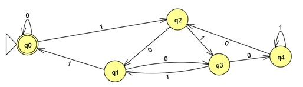

Se utilizan exactamente 5 estados porque representan los únicos residuos posibles al dividir cualquier número entre 5 (0,1,2,3,4). Al leer la cadena de derecha a izquierda se invierte la lógica normal (la lógica utilizada en el ejercicio 147). Se utiliza la fórmula inversa del módulo 5 para determinar el estado de origen.
$Estado_{origen} = (2 \times Estado_{destino} + 2 \times bit) \pmod 5$

---

**147. \*** Diseñe un AFD que lee un número binario de izquierda a derecha y lo acepta si es un múltiplo de 6.

Diagrama:
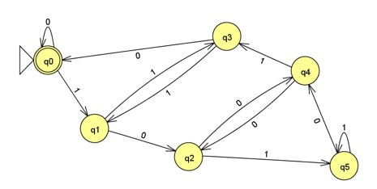

Se utilizan 6 estados porque representan los únicos residuos posibles al dividir cualquier número entre 6 (0,1,2,3,4,5). Al leer el bit de izquierda a derecha, cada bit nuevo equivale a multiplicar el valor actual por 2 y sumar el bit.
$Estado_{siguiente} = (2 \times Estado_{actual} + bit) \pmod 6$

---

**148. \*** Diseñar un autómata finito (FA) que modele el progreso de un alumno de la ESCOM a lo largo de una Unidad de Aprendizaje, en este caso el curso de Teoría de la Computación. El autómata debe representar las distintas decisiones que se toman en cada evaluación, como si el alumno aprueba, aplaza o no se presenta a un examen, y controlar que no se presenten más de dos convocatorias en un año. El autómata concluirá cuando el alumno apruebe el curso. El alfabeto de entrada estará formado por los siguientes elementos:
P: El alumno se presenta al examen.
N: El alumno no se presenta al examen.
A: El alumno aprueba el examen.
S: El alumno aplaza el examen.
El alumno comenzará en un estado inicial y tomará decisiones sobre si presentarse en las distintas convocatorias de febrero, septiembre y diciembre, hasta que apruebe el curso. Se deben evitar más de dos convocatorias en un año y reiniciar el ciclo en caso de no aprobar en las dos primeras.  

Diagrama:
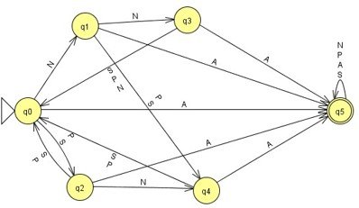

Los estados representan lo siguiente: 
* $q_0$: febrero, con 0 intentos gastados (por ser la primera convocatoria)
* $q_1$: septiembre, con 0 intentos gastados
* $q_2$: septiembre, con 1 intento gastado
* $q_3$: diciembre, con 0 intentos gastados
* $q_4$: diciembre, con 1 intento gastado
* $q_5$: aprobado (el estado final)

Si el alumno recibe N avanza al siguiente estado sin aumentar su contador de intentos, si recibe S o P avanza al siguiente estado, pero esto significa que gasta un intento por lo que transita a la rama con intentos gastados, si estando en esta rama recibe otro S o P entonces alcanza el límite máximo de intentos, por lo que obligatoriamente debería de transitar al estado inicial. Si se encuentra en $q_3$ o $q_4$ es donde el año concluye, por lo que cualquier decisión lo regresa al estado inicial a menos que haya aprobado. Además de que, en cualquier estado si se recibe A envía al alumno directo al estado de aceptación donde permanece indefinidamente por ya habar concluido con la UA.

---

En los problemas 149-150, considere el autómata $A = (Q, \Sigma, \delta, A_0, F)$ definido en cada tabla. Encuentre $Q, \Sigma, A_0$ y $F$, haga el diagrama de transiciones del autómata y halle los valores que se piden en cada inciso.

**149. \*** 
a) $\delta(B,0)$
b) $\delta(C,1)$
c) $\hat{\delta}(A,1101)$
d) $\hat{\delta}(A,01001)$

Tabla de estados:
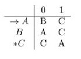

Diagrama:
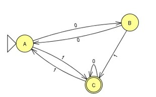

$Q: \{A, B, C\}$		$\Sigma: \{0, 1\}$		$A_0: A$		$F: \{C\}$

$\delta(B,0) = A$
$\delta(C,1) = A$

$\hat{\delta}(A,1101)$:
$\delta(A,\lambda) = A$
$\delta(A,1) = \delta(\delta(A,\lambda), 1) = \delta(A,1) = C$
$\delta(A,11) = \delta(\delta(A,1), 1) = \delta(C,1) = A$
$\delta(A,110) = \delta(\delta(A,11), 0) = \delta(A,0) = B$
$\delta(A,1101) = \delta(\delta(A,110), 1) = \delta(B,1) = C$

$\hat{\delta}(A,01001)$:
$\delta(A,\lambda) = A$
$\delta(A,0) = \delta(\delta(A,\lambda), 0) = \delta(A,0) = B$
$\delta(A,01) = \delta(\delta(A,0), 1) = \delta(B,1) = C$
$\delta(A,010) = \delta(\delta(A,01), 0) = \delta(C,0) = C$
$\delta(A,0100) = \delta(\delta(A,010), 0) = \delta(C,0) = C$
$\delta(A,01001) = \delta(\delta(A,0100), 1) = \delta(C,1) = A$

---

**150. \***
a) $\hat{\delta}(B,10a11)$
b) $\hat{\delta}(B,aa1100)$
c) $\hat{\delta}(A,a01a01)$
d) $\hat{\delta}(C,a11a00)$

Tabla de estados:
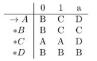

Diagrama:
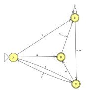

$Q: \{A, B, C, D\}$	$\Sigma: \{0, 1, a\}$		$A_0: A$		$F: \{B, C, D\}$

$\hat{\delta}(B,10a11)$:
$\delta(B,\lambda) = B$
$\delta(B,1) = \delta(\delta(B,\lambda), 1) = \delta(B,1) = C$
$\delta(B,10) = \delta(\delta(B,1), 0) = \delta(C,0) = A$
$\delta(B,10a) = \delta(\delta(B,10), a) = \delta(A,a) = D$
$\delta(B,10a1) = \delta(\delta(B,10a), 1) = \delta(D,1) = B$
$\delta(B,10a11) = \delta(\delta(B,10a1), 1) = \delta(B,1) = C$

$\hat{\delta}(B,aa1100)$:
$\delta(B,\lambda) = B$
$\delta(B,a) = \delta(\delta(B,\lambda), a) = \delta(B,a) = C$
$\delta(B,aa) = \delta(\delta(B,a), a) = \delta(C,a) = D$
$\delta(B,aa1) = \delta(\delta(B,aa), 1) = \delta(D,1) = B$
$\delta(B,aa11) = \delta(\delta(B,aa1), 1) = \delta(B,1) = C$
$\delta(B,aa110) = \delta(\delta(B,aa11), 0) = \delta(C,0) = A$
$\delta(B,aa1100) = \delta(\delta(B,aa110), 0) = \delta(A,0) = B$

$\hat{\delta}(A,a01a01)$:
$\delta(A,\lambda) = A$
$\delta(A,a) = \delta(\delta(A,\lambda), a) = \delta(A,a) = D$
$\delta(A,a0) = \delta(\delta(A,a), 0) = \delta(D,0) = B$
$\delta(A,a01) = \delta(\delta(A,a0), 1) = \delta(B,1) = C$
$\delta(A,a01a) = \delta(\delta(A,a01), a) = \delta(C,a) = D$
$\delta(A,a01a0) = \delta(\delta(A,a01a), 0) = \delta(D,0) = B$
$\delta(A,a01a01) = \delta(\delta(A,a01a0), 1) = \delta(B,1) = C$

$\hat{\delta}(C,a11a00)$:
$\delta(C,\lambda) = C$
$\delta(C,a) = \delta(\delta(C,\lambda), a) = \delta(C,a) = D$
$\delta(C,a1) = \delta(\delta(C,a), 0) = \delta(D,0) = B$
$\delta(C,a11) = \delta(\delta(C,a1), 1) = \delta(B,1) = C$
$\delta(C,a11a) = \delta(\delta(C,a11), a) = \delta(C,a) = D$
$\delta(C,a11a0) = \delta(\delta(C,a11a), 0) = \delta(D,0) = B$
$\delta(C,a11a00) = \delta(\delta(C,a11a0), 0) = \delta(B,0) = B$
```eof
