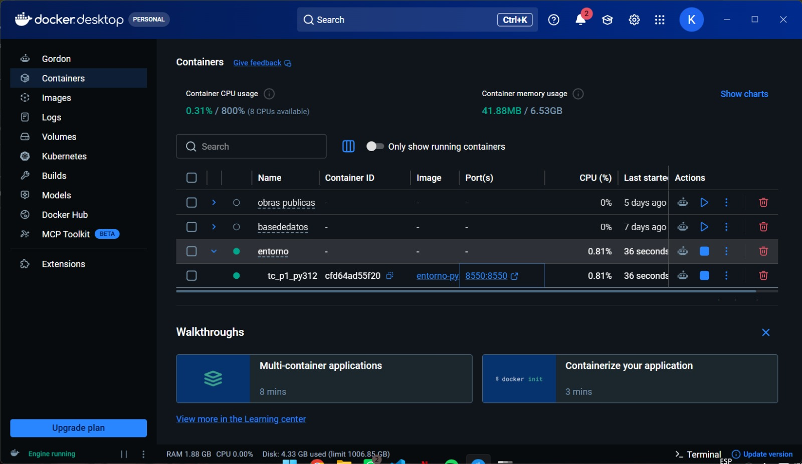
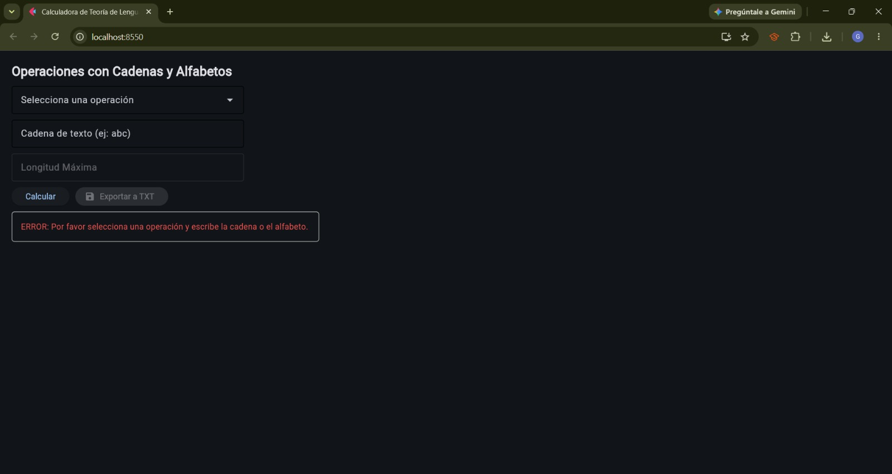
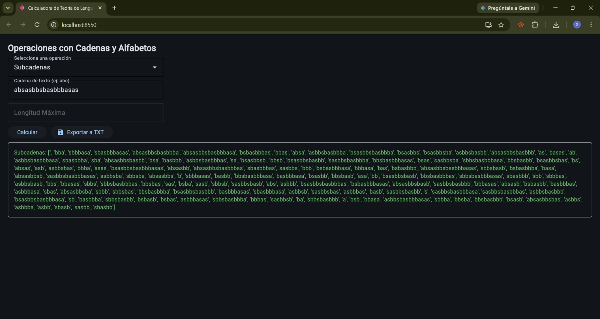
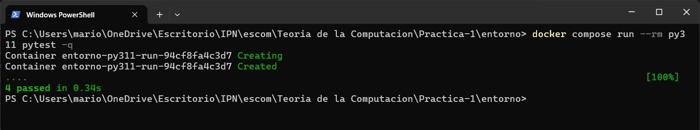
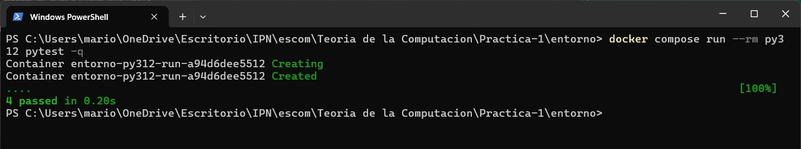

# Aplicación con interfaz gráfica
El resultado de la interfaz gráfica ejecutada desde contenedores fue el siguiente:
* **Ejcución de docker:** 
* **Ejcución en navegador:** 

## Operación 1. Subcadenas, prefijos y sufijos
### a. Número de prefijos de una cadena de longitud $n$
Una cadena $w$ de longitud $|w| = n$ posee exactamente $n + 1$ prefijos.
Esta afirmación se puede comprobar  matemáticamente:
Sea la cadena $w = a_1 a_2 \dots a_n$. Un prefijo de $w$ se define como cualquier cadena $v$ tal que existe una cadena $u$ que satisface $w = vu$.
Para cada valor entero $k \in {0, 1, 2, \dots, n}$, existe un único prefijo $v_k = a_1 a_2 \dots a_k$ formado por los primeros $k$ símbolos de $w$.
Cuando $k = 0$, $v_0 = \lambda$ (la cadena vacía).
Cuando $k = n$, $v_n = w$ (la cadena completa).
Puesto que hay $n + 1$ posibles valores para $k$, la cantidad total de prefijos es siempre $n + 1$, independientemente de si la cadena contiene caracteres repetidos o no.

### b. Máximo número de subcadenas distintas de una cadena de longitud $n$
El número máximo de subcadenas distintas que puede contener una cadena de longitud $n$ es:
$$\text{Máximo de subcadenas} = \frac{n(n + 1)}{2} + 1$$
Esta afirmación se puede comprobar  matemáticamente:
Una subcadena de $w$ es una secuencia de símbolos $a_i a_{i+1} \dots a_j$, con $1 \le i \le j \le n$.
* Subcadenas no vacías:
Subcadenas de longitud 1: hay $n$ posiciones posibles ($a_1, a_2, \dots, a_n$).
Subcadenas de longitud 2: hay $n - 1$ posiciones posibles.
Subcadenas de longitud $k$: hay $n - k + 1$ posiciones posibles.
Subcadenas de longitud $n$: hay $1$ posición ($w$).
Sumando todas las posibles posiciones de subcadenas no vacías se obtiene la serie aritmética:
$$\sum_{k=1}^{n} (n - k + 1) = n + (n - 1) + \dots + 2 + 1 = \frac{n(n + 1)}{2}$$
* Inclusión de la cadena vacía ($\lambda$):
Agregando la cadena vacía (longitud $0$), se suma $1$ al total, obteniendo $\frac{n(n + 1)}{2} + 1$.
Este límite máximo se alcanza únicamente si todos los símbolos de la cadena son distintos (por ejemplo, en la cadena abcde). Si hay caracteres repetidos (como en aaaaa), algunas subcadenas coincidirán en contenido, reduciendo el número de subcadenas distintas a $n + 1$.

### c. Inclusión de la cadena vacía ($\lambda$) en prefijos y sufijos
En el módulo [lenguajes.py](../src/lenguajes.py), la cadena vacía $\lambda$ (representada como una cadena vacía "") se incluye explícitamente tanto en el conjunto de prefijos como en el de sufijos. Esto debido a que por definición en Teoría de la Computación:
$\lambda$ es el elemento neutro de la operación de concatenación: $\lambda w = w \lambda = w$ para toda cadena $w \in \Sigma^*$.
$v$ es prefijo de $w$ si $\exists u \in \Sigma^* (w = vu)$. Si elegimos $u = w$, entonces $w = \lambda w$, lo que demuestra que $\lambda$ es prefijo trivial de toda cadena.
$v$ es sufijo de $w$ si $\exists u \in \Sigma^* (w = uv)$. Si elegimos $u = w$, entonces $w = w \lambda$, lo que demuestra que $\lambda$ es sufijo trivial de toda cadena.

## Operación 2. Cerradura de Kleene y cerradura positiva
### a. Relación entre el límite de $200,000$ cadenas y los conceptos de la unidad
Las operaciones de Cerradura de Kleene ($\Sigma^*$) y Cerradura Positiva ($\Sigma^+$) sobre un alfabeto no vacío $\Sigma$ producen conjuntos de cardinalidad infinita ($\aleph_0$). Incluso al acotar la generación a una longitud máxima $N$, la unión de lenguajes $L_0 \cup L_1 \cup \dots \cup L_N$ sigue una progresión geométrica.

Para un alfabeto de tamaño $|\Sigma|$, el número total de cadenas de longitud exacta $k$ es $|\Sigma|^k$. Por lo tanto, el número acumulado de cadenas hasta longitud $N$ en $\Sigma^*$ es:

$$|\Sigma^*{\le N}| = \sum{k=0}^{N} |\Sigma|^k = \frac{|\Sigma|^{N+1} - 1}{|\Sigma| - 1} \quad (\text{para } |\Sigma| > 1)$$

Por ejemplo, para un alfabeto de 4 símbolos ($\Sigma = {a, b, c, d}$) y una longitud máxima $N = 10$, el número total de cadenas generadas es:
$$\frac{4^{11} - 1}{3} = 1,398,101 \text{ cadenas}$$

* **Gestión de Recursos y Desbordamiento (OOM):** Mantener un arreglo en memoria con miles de cadenas genera una sobrecarga drástica en el recolector de basura de Python y un consumo excesivo de memoria RAM en el contenedor Docker.
* **Servidor Web y Renderizado en Flet:** La interfaz gráfica (Flet) debe serializar la salida para enviarla al cliente HTTP/WebSocket. Renderizar una lista con más de $200,000$ elementos colapsaría el hilo principal de la aplicación, provocando que el contenedor deje de responder o termine abruptly por Out Of Memory (OOM). 

## Pruebas autorizadas
Para la elaboración de la aplicación se utilizaron dos archivos distintos:
* [lenguajes.py](../src/lenguajes.py) (Núcleo de lógica pura): Contiene funciones deterministas sin efectos secundarios ni dependencias de interfaz (flet). Recibe datos primarios (cadenas, listas, enteros) y retorna conjuntos/listas. Esto permite auditar la corrección matemática mediante pruebas unitarias rápidas e independientes.
* [app.py](../src/app.py) (Interfaz de usuario): Se encarga únicamente de capturar los eventos de entrada desde la interfaz web/Flet, invocar las funciones de lenguajes.py y desplegar los resultados.

Esta estructura permite ejecutar la suite de pruebas [test_lenguajes.py](../tests/test_lenguajes.py) dentro de el entorno del contenedor en Docker sin necesidad de una interfaz gráfica a traves de los siguientes comandos:

```bash
docker compose run --rm py311 pytest -q
```


```bash
docker compose run --rm py312 pytest -q
```


```bash
docker compose run --rm py313 pytest -q
```


* **Comparativa:** 
| Servicio | Imagen Base | Comando Ejecutado | Resultado `pytest` | Diferencias de Comportamiento / Observaciones |
| :--- | :--- | :--- | :--- | :--- |
| `py311` | `python:3.11-slim` | `docker compose run --rm py311 pytest -q` | **PASSED** | Versión estable. Satisface los requisitos mínimos para la versión de Flet utilizada (`flet[web]`). |
| `py312` | `python:3.12-slim` | `docker compose run --rm py312 pytest -q` | **PASSED** | Versión de referencia del curso. Ejecución correcta y servicio web desplegado en el puerto `8550`. |
| `py313` | `python:3.13-slim` | `docker compose run --rm py313 pytest -q` | **PASSED** | Sin incompatibilidades. Las funciones de manipulación de cadenas y lenguajes funcionan sin alteraciones. |
