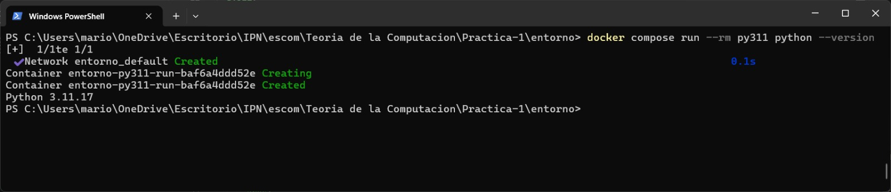
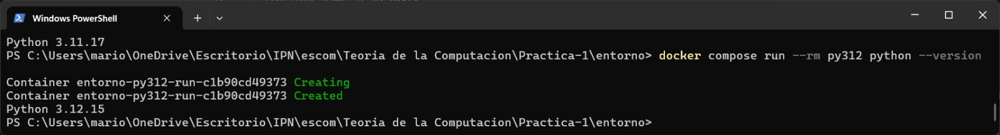
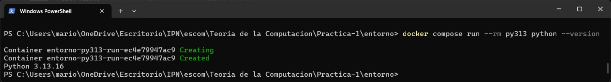

# Justificación de versiones Python, Dockerfile y Compose
---
## Versiones
**py311 (python:3.11-slim):**
Es la versión más antigua de Python que aún cuenta con soporte activo/mantenimiento oficial y que cumple con el requisito mínimo de versión para la publicación de Flet utilizada en la práctica. Permite validar retrocompatibilidad con versiones previas aún vigentes.

Evidencia de ejecución con contenedores:


**py312 (python:3.12-slim):**
Es la versión de referencia oficial del curso. Es la encargada de ejecutar y servir la aplicación web interactiva (app.py), garantizando un comportamiento estable y estandarizado para las revisiones.

Evidencia de ejecución con contenedores:


**py313 (python:3.13-slim):**
Es una versión reciente del lenguaje. Permite verificar que el código implementado (especialmente el núcleo lenguajes.py) no dependa de características obsoletas o de comportamientos internos que hayan cambiado o sido eliminados en las últimas entregas de Python.

Evidencia de ejecución con contenedores:


- Puede consultar los requisitos así como el proceso para instalar Flet en: [Instalación de Flet](https://flet.dev/docs/getting-started/installation/)
- Aunque no existe un calendario para el soporte de Flet, puede consultar como instalar versiones anteriores en: [Instalación de versiones Flet](https://flet.dev/blog/flet-versioning-and-pre-releases/)
- Así como las novedades de la versión 0.86.0 en: [Novedades 0.86.0 Flet](https://flet.dev/blog/flet-v-0-86-release-announcement)

---
## Dokcerfile (explicación de lineas de código)
Para la elaboración de esta práctica se hizo uso del [Dockerfile](entorno/Dockerfile) anexado por el profesor, por lo que como requisito se realiza la explicación de las líneas de código a continuación:
```dockerfile
# Un solo Dockerfile para las tres versiones. El numero de version
# llega desde compose.yml como argumento de construccion
# Declara la variable de construcción PYTHON_VERSION con el valor 3.12 por defecto
ARG PYTHON_VERSION=3.12

# Establece la imagen base ligera (slim) utilizando la versión de Python que dicte la variable anterior
FROM python:${PYTHON_VERSION}-slim

# El entorno virtual va en /opt/venv, fuera de /app
# /opt/venv/bin al principio del PATH equivale a activarlo
# Ejecuta la creación de un entorno virtual de Python en la ruta /opt/venv
RUN python -m venv /opt/venv

# Añade la carpeta de binarios del entorno virtual al inicio del PATH del sistema operativo, dejándolo activado por defecto
ENV PATH="/opt/venv/bin:$PATH"

# Define /app como el directorio de trabajo donde ocurrirán las siguientes acciones de copiado y ejecución
WORKDIR /app

# Las dependencias antes que el codigo, para reutilizar la capa
# mientras requirements.txt no cambie
# Copia primero únicamente el archivo de dependencias al directorio de trabajo actual
COPY requirements.txt .

# Actualiza el gestor pip e instala las librerías del requirements.txt sin guardar archivos temporales de caché para optimizar espacio
RUN pip install --no-cache-dir --upgrade pip \
&& pip install --no-cache-dir -r requirements.txt

# Copia todo el código fuente restante de tu equipo al directorio de trabajo del contenedor
COPY . .

# Flet, al no encontrar escritorio, arranca como servidor web
# Fuerza al framework Flet a arrancar en modo de servidor web en lugar de buscar un entorno de escritorio
ENV FLET_FORCE_WEB_SERVER=true

# Configura el puerto 8550 para que el servidor web de Flet reciba conexiones
ENV FLET_SERVER_PORT=8550

# Especifica el comando final predeterminado al iniciar el contenedor, el cual ejecuta el script principal de la aplicación
CMD ["python", "src/app.py"]
```
---
## Compose (explicación de lineas de código)
Para la elaboración de esta práctica se hizo uso del [compose.yml](entorno/compose.yaml) anexado por el profesor, por lo que como requisito se realiza la explicación de las líneas de código a continuación:
```yaml
# Define los contenedores (servicios) que se van a ejecutar en este entorno
services:
  # Inicia la definición del primer servicio, llamado py311
  py311:
    # Indica la configuración de construcción para la imagen del contenedor
    build:
      # Establece el directorio padre (..) como contexto de construcción para ubicar archivos
      context: ..
      # Especifica la ruta exacta del archivo Dockerfile a utilizar
      dockerfile: entorno/Dockerfile
      # Permite declarar argumentos de construcción
      args:
        # Pasa el valor "3.11" a la variable PYTHON_VERSION para definir la versión del entorno
        PYTHON_VERSION: "3.11"
    # Asigna el nombre fijo "tc_p1_py311" al contenedor
    container_name: tc_p1_py311
    # Permite sincronizar directorios locales con el contenedor
    volumes:
      # Conecta el directorio padre local (..) con la carpeta /app dentro del contenedor
      - ..:/app
    # Sobrescribe el comando por defecto para ejecutar pruebas unitarias de forma concisa con pytest
    command: pytest -q

  # Define el segundo servicio compartiendo la misma estructura básica de construcción
  py312:
    build:
      context: ..
      dockerfile: entorno/Dockerfile
      args:
        # Define que este contenedor utilizará la versión "3.12" de Python
        PYTHON_VERSION: "3.12"
    # Nombra a este contenedor específico "tc_p1_py312"
    container_name: tc_p1_py312
    # Define la configuración de puertos expuestos
    ports:
      # Mapea el puerto 8550 del equipo local al puerto 8550 del contenedor
      - "8550:8550" # equipo : contenedor
    # Monta el directorio padre local en /app para sincronizar los archivos
    volumes:
      - ..:/app

  # Define el tercer servicio
  py313:
    # Repite la configuración de construcción
    build:
      context: ..
      dockerfile: entorno/Dockerfile
      args:
        # Pasa el valor "3.13" a la variable PYTHON_VERSION
        PYTHON_VERSION: "3.13"
    # Le asigna el nombre "tc_p1_py313" al contenedor
    container_name: tc_p1_py313
    # Sincroniza el directorio padre con la carpeta /app
    volumes:
      - ..:/app
    # Ejecuta pruebas con pytest al iniciar, al igual que el primer servicio
    command: pytest -q
```